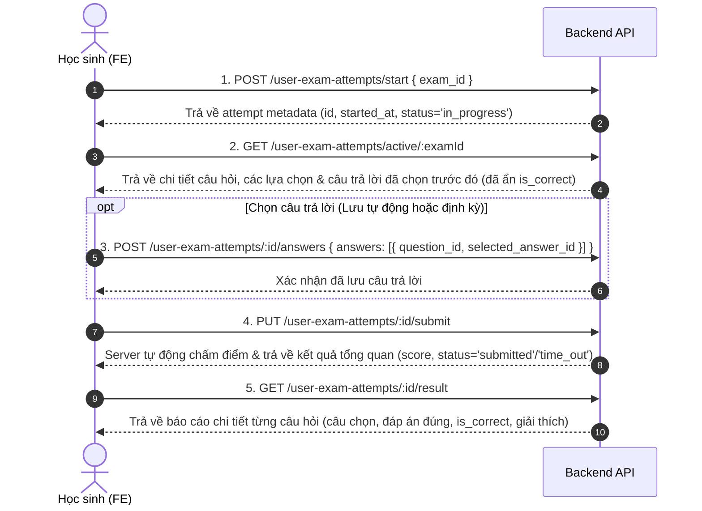

# 📋 LearningHub — Tài liệu API Đầy đủ (Dành cho FE AI Agent)

> **Phiên bản**: 1.0.14  
> **Base URL**: `http://localhost:8080`  
> **Swagger UI Docs**: `http://localhost:8080/` (Tự động chuyển hướng từ gốc)  
> **Cập nhật lần cuối**: 2026-08-08  
> **Mục đích**: Tài liệu này được chuẩn hóa chi tiết 100% để **AI Agent làm phần Front-End (FE)** hoặc Lập trình viên FE có thể tiếp quản dự án và tích hợp API một cách chính xác nhất.

---

## 📌 Quy chuẩn Chung & Cấu trúc Dữ liệu

### 1. Phân quyền & Authentication
- **Cơ chế**: JWT Access Token (Header) + Refresh Token (HttpOnly Cookie).
- **Header xác thực**: `Authorization: Bearer <access_token>`
- **Vai trò (Roles)**:
  - `student`: Học sinh (Xem môn học, làm bài thi, xem kết quả cá nhân, cập nhật profile/avatar, đổi mật khẩu).
  - `admin`: Quản trị viên (CRUD môn học, đề thi, câu hỏi, đáp án, sinh đề AI, xem thống kê).

### 2. Định dạng Response Chuẩn (Response Format)
Tất cả các API đều trả về duy nhất một cấu trúc JSON chuẩn:
```json
{
  "success": true,
  "message": "Thông báo ngắn gọn bằng tiếng Anh hoặc tiếng Việt",
  "responseObject": { ... } | [ ... ] | null,
  "statusCode": 200
}
```

### 3. Định dạng Dữ liệu (Data Formats)
- **ID**: Tất cả ID là **UUID v7** dạng chuỗi 36 ký tự (VD: `"019116a3-7a5e-7def-8b6c-1a2b3c4d5e6f"`).
- **Thời gian**: ISO 8601 String UTC (VD: `"2026-08-08T10:00:00.000Z"`).
- **File đính kèm / Ảnh Avatar**:
  - Đăng tải dạng `multipart/form-data`.
  - Ảnh Avatar sau khi upload sẽ trả về đường dẫn tương đối (VD: `/uploads/avatars/avatar-xxx.png`).
  - FE hiển thị ảnh bằng cách truy cập: `http://localhost:8080/uploads/avatars/avatar-xxx.png`.

---

## 📐 Quy trình Tích hợp FE (Client User Flows)

### Flow 1: Đăng nhập & Lấy thông tin cá nhân
1. Gọi `POST /auth/login` với `{ "identify": "username_or_email", "password": "..." }`.
2. Lưu `accessToken` từ `responseObject.accessToken` vào bộ nhớ FE (state/RAM). Cookie refresh token sẽ tự động được trình duyệt lưu.
3. Gửi header `Authorization: Bearer <accessToken>` và gọi `GET /users/me` để lấy thông tin cá nhân đầy đủ (gồm avatar, email, role,...).
4. Nếu Access Token hết hạn (401), gọi `POST /auth/token` để tự động cấp lại token mới bằng Cookie.

### Flow 2: Thực hiện Bài thi (Exam Attempt Workflow)


---

## 📑 Danh mục API Chi tiết theo Module

---

### 🔑 1. Authentication (`/auth`)

#### `POST /auth/register` — Đăng ký tài khoản mới
- **Quyền**: Public
- **Request Body**:
  ```json
  {
    "full_name": "Nguyễn Văn A",
    "username": "nguyenvana",
    "email": "a@example.com",
    "password": "Password123"
  }
  ```
- **Response (200 OK)**:
  ```json
  {
    "success": true,
    "message": "Register successful",
    "responseObject": {
      "user": {
        "id": "019db44e-4581-70ca-978f-bebf6e23fb57",
        "username": "nguyenvana",
        "email": "a@example.com",
        "role": "student"
      }
    },
    "statusCode": 200
  }
  ```

#### `POST /auth/login` — Đăng nhập
- **Quyền**: Public
- **Request Body**:
  ```json
  {
    "identify": "nguyenvana", // Hoặc "a@example.com"
    "password": "Password123"
  }
  ```
- **Response (200 OK)**:
  ```json
  {
    "success": true,
    "message": "Login successful",
    "responseObject": {
      "user": {
        "id": "019db44e-4581-70ca-978f-bebf6e23fb57",
        "username": "nguyenvana",
        "email": "a@example.com",
        "role": "student"
      },
      "accessToken": "eyJhbGciOiJIUzI1NiIs..."
    },
    "statusCode": 200
  }
  ```
  *(Server tự động gắn HttpOnly Cookie `refreshToken` vào browser response).*

#### `POST /auth/token` — Làm mới Access Token
- **Quyền**: Public (Yêu cầu HttpOnly Cookie `refreshToken`).
- **Response (200 OK)**:
  ```json
  {
    "success": true,
    "responseObject": {
      "accessToken": "eyJhbGciOiJIUzI1NiIs..."
    },
    "statusCode": 200
  }
  ```

#### `POST /auth/logout` — Đăng xuất
- **Quyền**: 🔒 Authenticated
- **Response (200 OK)**: Revoke token và xóa Cookie.

---

### 👤 2. User & Profile (`/users`)

#### `GET /users/me` ⭐ — Lấy thông tin cá nhân hiện tại
- **Quyền**: 🔒 Authenticated
- **Response (200 OK)**:
  ```json
  {
    "success": true,
    "message": "User profile retrieved successfully",
    "responseObject": {
      "id": "019db44e-4581-70ca-978f-bebf6e23fb57",
      "email": "a@example.com",
      "full_name": "Nguyễn Văn A",
      "username": "nguyenvana",
      "role": "student",
      "avatar_url": "/uploads/avatars/avatar-123.jpg",
      "created_at": "2026-08-08T10:00:00.000Z"
    },
    "statusCode": 200
  }
  ```

#### `PUT /users/change-avatar` — Cập nhật ảnh đại diện
- **Quyền**: 🔒 Authenticated
- **Content-Type**: `multipart/form-data`
- **Form Data**: `avatar` (File: JPG, PNG, WEBP. Max 5MB).
- **Response (200 OK)**: Trả về thông tin User kèm `avatar_url` mới.

#### `PUT /users/change-password` — Đổi mật khẩu
- **Quyền**: 🔒 Authenticated
- **Request Body**:
  ```json
  {
    "oldPassword": "Password123",
    "newPassword": "NewPassword456"
  }
  ```

#### `GET /users` — Lấy danh sách tất cả người dùng
- **Quyền**: 🔒 Admin Only

#### `GET /users/:id` — Lấy chi tiết người dùng theo ID
- **Quyền**: 🔒 Admin Only

#### `PUT /users/change-user-role` — Đổi vai trò người dùng (Student ↔ Admin)
- **Quyền**: 🔒 Admin Only
- **Request Body**: `{ "id": "uuid", "newRole": "admin" }`

---

### 📚 3. Subject — Môn học (`/subjects`)

#### `GET /subjects` — Lấy danh sách tất cả môn học
- **Quyền**: Public
- **Response (200 OK)**:
  ```json
  {
    "success": true,
    "responseObject": [
      {
        "id": "019db44e-4581-70ca-978f-bebf6e23fb57",
        "name": "Cơ sở dữ liệu",
        "description": "Môn học về SQL và RDBMS"
      }
    ]
  }
  ```

#### `GET /subjects/:id` — Chi tiết môn học
- **Quyền**: Public

#### `POST /subjects` — Tạo môn học mới
- **Quyền**: 🔒 Admin Only
- **Body**: `{ "name": "Lập trình Web", "description": "HTML, CSS, JS" }`

#### `PUT /subjects/:id` — Cập nhật môn học
- **Quyền**: 🔒 Admin Only

#### `DELETE /subjects/:id` — Xóa môn học
- **Quyền**: 🔒 Admin Only *(⚠️ Xóa liên đới đến tất cả đề thi thuộc môn này)*

---

### 📘 4. Exam — Đề thi (`/exams`)

#### `GET /exams` — Lấy danh sách tất cả đề thi
- **Quyền**: Public / Authenticated

#### `GET /exams/subject/:subjectId` — Lấy danh sách đề thi theo Môn học
- **Quyền**: Public / Authenticated

#### `GET /exams/:id` — Lấy metadata của 1 đề thi
- **Quyền**: Authenticated

#### `GET /exams/:id/detail` ⭐ — Lấy đề thi đầy đủ kèm câu hỏi & đáp án (Cho học sinh)
- **Quyền**: 🔒 Authenticated
- **Đặc điểm**: Đã tự động **ẩn toàn bộ trường `is_correct`** khỏi câu trả lời để chống gian lận.
- **Response (200 OK)**:
  ```json
  {
    "success": true,
    "responseObject": {
      "exam": {
        "id": "exam-uuid",
        "title": "Đề thi Giữa Kỳ CSDL",
        "duration_minutes": 60,
        "total_marks": 100,
        "pass_percentage": 50
      },
      "questions": [
        {
          "id": "q1-uuid",
          "content": "SQL là viết tắt của cụm từ nào?",
          "answers": [
            { "id": "a1-uuid", "question_id": "q1-uuid", "content": "Structured Query Language" },
            { "id": "a2-uuid", "question_id": "q1-uuid", "content": "Simple Query Language" }
          ]
        }
      ]
    }
  }
  ```

#### `POST /exams` — Tạo đề thi mới (Metadata)
- **Quyền**: 🔒 Admin Only
- **Body**:
  ```json
  {
    "title": "Đề thi Giữa Kỳ CSDL",
    "description": "Bài thi 60 phút",
    "subject_id": "subject-uuid",
    "duration_minutes": 60,
    "total_marks": 100,
    "pass_percentage": 50,
    "is_published": true
  }
  ```

#### `PUT /exams/:id` — Cập nhật đề thi
- **Quyền**: 🔒 Admin Only

#### `DELETE /exams/:id` — Xóa đề thi
- **Quyền**: 🔒 Admin Only

#### `POST /exams/import` ⭐ — Import đề thi từ file Excel
- **Quyền**: 🔒 Admin Only
- **Content-Type**: `multipart/form-data`
- **Form Data**:
  - `file`: File Excel `.xlsx` (Phải chứa 2 sheet: `Exam` và `Questions`).
  - `subject_id`: UUID môn học (Tùy chọn nếu trong file Excel chưa có).

---

### ❓ 5. Question & Answer — Câu hỏi & Đáp án (`/questions`, `/answers`)

#### `GET /questions` — Lấy danh sách câu hỏi
#### `GET /questions/:id` — Lấy 1 câu hỏi
#### `POST /questions` — Tạo câu hỏi
- **Body**: `{ "content": "Nội dung câu hỏi..." }` (Admin Only)

#### `GET /answers/question/:questionId` — Lấy danh sách đáp án của 1 câu hỏi (Bao gồm `is_correct`)
- **Quyền**: 🔒 Admin Only / Teacher

#### `POST /answers` — Tạo đáp án cho câu hỏi
- **Body**: `{ "question_id": "uuid", "content": "Nội dung đáp án", "is_correct": true }` (Admin Only)

---

### 📝 6. User Exam Attempt — Làm bài thi (`/user-exam-attempts`)

#### `POST /user-exam-attempts/start` ⭐ — Bắt đầu / Tiếp tục lượt làm bài
- **Quyền**: 🔒 Authenticated (Student)
- **Request Body**: `{ "exam_id": "exam-uuid" }`
- **Xử lý**: Nếu đã có lượt thi `in_progress`, tự động trả lại lượt thi đó. Nếu chưa, tạo lượt thi mới.

#### `GET /user-exam-attempts/active/:examId` ⭐ — Khôi phục trạng thái bài thi đang dở
- **Quyền**: 🔒 Authenticated
- **Mục đích**: FE dùng để resume khi người dùng F5 hoặc rớt mạng.
- **Response**: Trả về `attempt`, danh sách `questions` kèm các đáp án và `saved_answers` (các câu hỏi thí sinh đã chọn trước đó, đã ẩn `is_correct`).

#### `POST /user-exam-attempts/:id/answers` ⭐ — Lưu câu trả lời hàng loạt (Batch Save)
- **Quyền**: 🔒 Authenticated (Owner of attempt)
- **Request Body**:
  ```json
  {
    "answers": [
      { "question_id": "q1-uuid", "selected_answer_id": "a1-uuid" },
      { "question_id": "q2-uuid", "selected_answer_id": "a4-uuid" }
    ]
  }
  ```

#### `PUT /user-exam-attempts/:id/submit` ⭐ — Nộp bài thi & Server tự chấm điểm
- **Quyền**: 🔒 Authenticated (Owner of attempt)
- **Request Body**: `{ "answers": [ ... ] }` (Tùy chọn gửi kèm các câu chọn cuối cùng hoặc rỗng `{}`).
- **Tính năng Server**:
  - Tự động tính điểm phía Server (Client không được gửi điểm).
  - Tự động tính thời gian `time_spent_seconds`.
  - Tự động chuyển `status` sang `time_out` nếu vượt quá `duration_minutes` của bài thi.

#### `GET /user-exam-attempts/:id/result` ⭐ — Xem báo cáo chi tiết kết quả bài thi
- **Quyền**: 🔒 Authenticated (Owner / Admin)
- **Đặc điểm**: Chỉ gọi được khi trạng thái khác `in_progress`.
- **Response**: Trả về tổng điểm, số câu đúng/sai, chi tiết từng câu hỏi, đáp án thí sinh đã chọn, đáp án đúng và lời giải thích.

#### `GET /user-exam-attempts/user/:userId` — Lấy lịch sử tất cả lượt thi của người dùng
- **Quyền**: 🔒 Authenticated (Truyền `:userId` là `me` để lấy cho bản thân).

---

### 📊 7. Statistics — Thống kê (`/statistics`)

#### `GET /statistics/exam/:examId`
- **Quyền**: 🔒 Admin Only
- **Response**: Thống kê tổng số lượt làm bài, điểm trung bình, tỷ lệ đỗ/trượt của 1 đề thi.

#### `GET /statistics/admin/overview`
- **Quyền**: 🔒 Admin Only
- **Response**: Thống kê tổng quan toàn hệ thống (Tổng số học sinh, số môn học, số đề thi, số lượt thi).

---

### 🤖 8. AI Generation & Vector RAG (`/ai`)

#### `POST /ai/generate-exam` — Tự động tạo đề thi bằng AI (LLM)
- **Quyền**: 🔒 Admin Only
- **Request Body**:
  ```json
  {
    "subject_id": "subject-uuid",
    "topic": "Tối ưu hóa truy vấn SQL",
    "num_questions": 10,
    "difficulty": "medium", // "easy" | "medium" | "hard" | "mixed"
    "language": "vi", // "vi" | "en"
    "exam_title": "Đề kiểm tra Tối ưu SQL",
    "exam_duration_minutes": 45,
    "provider": "openrouter", // "openrouter" | "ollama" | "nvidia"
    "auto_save": true
  }
  ```

#### `POST /ai/upload-document` — Tải tài liệu (.md, .txt) vào Vector Database (Qdrant)
- **Quyền**: 🔒 Admin Only
- **Content-Type**: `multipart/form-data` (`file`, `subject_id`)

#### `POST /ai/sync-questions` — Đồng bộ câu hỏi SQL sang Vector DB
- **Quyền**: 🔒 Admin Only
- **Body**: `{ "subject_id": "subject-uuid" }`

#### `GET /ai/vector-status` — Trạng thái hệ thống Vector Database
- **Quyền**: 🔒 Admin Only

---

## 🛑 Mã lỗi HTTP (HTTP Error Codes) & Cách xử lý ở FE

| Status Code | Ý nghĩa | Cách xử lý gợi ý ở FE |
|---|---|---|
| `400 Bad Request` | Dữ liệu gửi lên không đúng định dạng (zod validation error) | Hiển thị thông báo lỗi từ `message` cho người dùng chỉnh sửa input |
| `401 Unauthorized` | Token không hợp lệ hoặc đã hết hạn | Tự động gọi `POST /auth/token` để refresh token. Nếu thất bại, chuyển về trang `/login` |
| `403 Forbidden` | Không có quyền truy cập (VD: Học sinh truy cập route Admin) | Hiển thị thông báo "Bạn không có quyền thực hiện thao tác này" |
| `404 Not Found` | Không tìm thấy tài nguyên (User, Exam, Attempt,...) | Hiển thị trang 404 hoặc thông báo dữ liệu không tồn tại |
| `409 Conflict` | Dữ liệu đã tồn tại (VD: trùng username/email) | Thông báo người dùng chọn thông tin khác |
| `500 Internal Server Error` | Lỗi phía Server | Hiển thị thông báo "Hệ thống gặp sự cố, vui lòng thử lại sau" |
